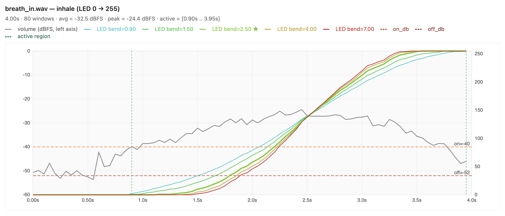
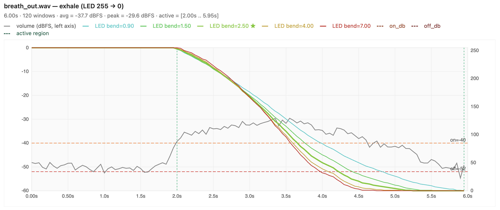

# Breathing Light

A hardware breath pacer. A warm LED strip rises and falls in time with recorded inhale/exhale audio so you can follow along and regulate your breathing — eyes open or closed.

Runs on an ESP32-S3 with an OLED + rotary encoder menu to tweak volume, brightness, pause length, and the curve shape of the light. Settings persist across power cycles.

> **Vibe coded with [Claude Code](https://www.anthropic.com/claude-code).** This repo is an experiment in letting an AI coding agent drive most of the implementation while I steer — more "describe what I want, review the diff" than hand-written line by line. [`CLAUDE.md`](CLAUDE.md) at the repo root is the agent's rulebook. See [section 10](#10-ai-coding-agent-setup).



---

## What it does

- **Plays** a recorded inhale (4 s) and exhale (6 s) loop through an I2S DAC.
- **Breathes** a 12 V LED strip in sync with the audio — the brightness curve is derived from the RMS envelope of the WAV files, so the light actually tracks the sound of the breath rather than just a sine wave.
- **Pauses** between phases by a configurable amount (0–30 s each side) for box-breathing style patterns.
- **Menu** on a 128×64 OLED — rotary encoder to scroll/edit, confirm + back buttons to navigate. LED and audio can be toggled independently.
- **Remembers** all settings in NVS (flash).

### Hardware

| Part | Role |
|---|---|
| YD-ESP32-23 (ESP32-S3, 16 MB flash, 8 MB PSRAM) | MCU |
| SH1106 128×64 OLED | Menu display |
| Rotary encoder + 2 push buttons | Input |
| PCM5102 I2S DAC + small amp/speaker | Audio out |
| IRLZ44N MOSFET + 12 V LED strip | Light |

---

## Quick start

```bash
# 1. Install PlatformIO (VS Code extension, or: pip install platformio)
# 2. Plug the board into its UART USB-C port (see §3)
# 3. Find your serial port and update platformio.ini (see §4)
pio run --target upload      # flash firmware
pio run --target uploadfs    # flash WAVs to SPIFFS
pio device monitor           # watch serial
```

New to PlatformIO or this board? The rest of this document walks through it end-to-end.

---

## Table of Contents

1. [Prerequisites](#1-prerequisites)
2. [Install PlatformIO](#2-install-platformio)
3. [Physical setup — which USB port to use](#3-physical-setup--which-usb-port-to-use)
4. [Find your serial port and configure platformio.ini](#4-find-your-serial-port-and-configure-platformioini)
5. [Build and upload](#5-build-and-upload)
6. [Running tests](#6-running-tests)
7. [Hardware wiring — LED strip (IRLZ44N MOSFET)](#7-hardware-wiring--led-strip-irlz44n-mosfet)
8. [Rotary encoder notes](#8-rotary-encoder-notes)
9. [Updating the LED envelope after changing audio files](#9-updating-the-led-envelope-after-changing-audio-files)
10. [Project structure](#10-project-structure)
11. [AI coding agent setup](#11-ai-coding-agent-setup)
12. [License](#12-license)

---

## 1. Prerequisites

- A computer running macOS, Linux, or Windows
- Python 3.8 or newer (required by PlatformIO, and by the envelope generator in §8)
- A USB-C cable (data-capable, not charge-only)
- The YD-ESP32-23 board, wired as in §7 and `modules_connections.md`

---

## 2. Install PlatformIO

PlatformIO can be used as a VS Code extension or as a standalone CLI tool. Both are supported.

**VS Code extension (recommended for beginners):**

1. Install [Visual Studio Code](https://code.visualstudio.com/)
2. Open the Extensions panel and search for **PlatformIO IDE**
3. Install it — the `pio` CLI becomes available automatically in the integrated terminal

**CLI only:**

```bash
pip install platformio
```

Verify the installation:

```bash
pio --version
```

---

## 3. Physical setup — which USB port to use

The YD-ESP32-23 has **two USB-C connectors** on the board. Using the wrong one is the most common source of confusion.

```
┌─────────────────────────────────────┐
│          YD-ESP32-23                │
│                                     │
│  [UART] ← use this one              │
│  [USB]  ← do NOT use for flashing   │
│                                     │
└─────────────────────────────────────┘
```

| Connector label | Chip behind it | When to use |
|-----------------|----------------|-------------|
| `UART`          | CH343P (dedicated USB-to-UART bridge) | **Always** — for upload, tests, and serial monitor |
| `USB`           | ESP32-S3 built-in USB peripheral | Not needed for this workflow |

**Always plug into the `UART` connector.**

The `UART` connector uses a CH343P chip — a separate, dedicated bridge that stays alive regardless of what the ESP32-S3 is doing (including resets and flashing). This is critical for test runs: after the board is flashed it resets, and if the serial port disappears during that reset `pio test` will hang waiting for output that never arrives. The CH343P port does not disappear.

The `USB` connector exposes the ESP32-S3's built-in USB peripheral directly. It drops off the bus during resets, which breaks the test runner.

---

## 4. Find your serial port and configure platformio.ini

PlatformIO needs to know which serial port your board is connected to. You must set this once for your machine.

### On macOS / Linux

List ports before and after plugging in the board to identify the new one:

```bash
# Before plugging in
ls /dev/cu.*

# Plug in the UART connector, then run again
ls /dev/cu.*
```

The new entry is your board's port. It will look something like:

```
/dev/cu.usbmodem5ABA0887541   # macOS (CH343P)
/dev/ttyUSB0                  # Linux (CH343P)
```

### On Windows

Open **Device Manager**, expand **Ports (COM & LPT)**, and look for the new COM port that appears when you plug in the board (e.g. `COM3`).

### Update platformio.ini

Open `platformio.ini` and replace the port values in the `[env:yd_esp32_23]` section:

```ini
upload_port = /dev/cu.usbmodem5ABA0887541   ; <- replace with your port
test_port   = /dev/cu.usbmodem5ABA0887541   ; <- same port, replace here too
```

On Windows it would be:

```ini
upload_port = COM3
test_port   = COM3
```

> Both `upload_port` and `test_port` should point to the same port — the CH343P `UART` connector.

---

## 5. Build and upload

Build the project (compiles without uploading):

```bash
pio run
```

Build and flash firmware:

```bash
pio run --target upload
```

Flash the SPIFFS partition with the breath WAVs in `data/`:

```bash
pio run --target uploadfs
```

You only need to re-run `uploadfs` when the files in `data/` change. The LED envelope tables (`include/led_envelope.h`) are separately baked into firmware — see §8.

Open the serial monitor:

```bash
pio device monitor
```

Press `Ctrl+C` to exit the monitor.

---

## 6. Running tests

Tests live in `test/`. PlatformIO supports two environments:

| Environment | Runs on | Board required |
|-------------|---------|----------------|
| `native`    | Your computer | No |
| `yd_esp32_23` | The physical board | Yes, connected via `UART` |

```bash
# Run logic tests on your computer (no board needed)
pio test -e native

# Run hardware tests on the board (board must be connected)
pio test -e yd_esp32_23
```

See [how_to_unit_test.md](how_to_unit_test.md) for a full guide on writing and running tests.

---

## 7. Hardware wiring — LED strip (IRLZ44N MOSFET)

The LED strip is driven by an **IRLZ44N** logic-level N-channel MOSFET controlled via PWM on **GPIO 1** (25 kHz, 10-bit — above the audio band, so no audible coil whine from the strip). The breathing animation varies the duty cycle across each breath cycle.

For the full pin map (OLED, rotary encoder, buttons, I2S DAC) see [`modules_connections.md`](modules_connections.md).

### Schematic

```
12V PSU (+) ──────────────────────────────────── LED Strip (+)
                                                  LED Strip (–) ─── IRLZ44N Drain (pin 2)
12V PSU (–) ─── GND rail ──────────────────────── IRLZ44N Source (pin 3)
                    │
                    ├──── ESP32 GND
                    │
                    └──── 10 kΩ ──── IRLZ44N Gate (pin 1)   ← pull-down

ESP32 GPIO 1 ──── 330 Ω ──── IRLZ44N Gate (pin 1)
```

### Component notes

| Component | Value | Purpose |
|-----------|-------|---------|
| Gate series resistor | 330 Ω | Limits GPIO inrush current on each switching edge |
| Gate pull-down resistor | 10 kΩ (Gate → GND) | Keeps MOSFET off if GPIO 1 floats during boot/reset |
| Common ground | Required | 12V PSU GND and ESP32 GND must share the same rail |

The IRLZ44N is a logic-level MOSFET (Vgs(th) ≈ 1–2 V), so 3.3 V from the ESP32 drives it fully on (Rds(on) ≈ 22 mΩ). No level shifter is needed. LED strips are resistive loads, so no flyback diode is required.

---

## 8. Rotary encoder notes

The menu uses a plain KY-040-style rotary encoder on GPIO 5 (A/CLK) and GPIO 4 (B/DT), with the push switch on GPIO 6. Decoding goes through the **`RotaryEncoder`** library (pulled in via `lib_deps` as `mbed-aluqard/arduino`), which handles the quadrature state machine and interrupt setup — writing this from scratch against the raw A/B signal was the single hardest part of bring-up, and the library made it straightforward.

**Known issue — mechanical bounce.** Even with the library's built-in debouncing, cheap encoders occasionally register **two steps for a single detent**, causing the menu to skip an option. This is a hardware-level contact bounce problem, not a software one — the encoder's switches are genuinely closing and opening multiple times per click. Adding more aggressive software filtering trades one bug for another (missed detents at fast rotation).

**Workaround / todo:** swap in a higher-quality encoder (e.g. Bourns PEC11R, Alps EC11) with cleaner detents and tighter bounce specs. A small hardware RC filter (typically 10 kΩ pull-up + 10 nF to GND on each of A and B, near the encoder) also helps when the encoder can't be replaced. Not yet tested on this board.

---

## 9. Updating the LED envelope after changing audio files

The LED represents "air in the lungs" and its brightness curve is derived from the breathing audio. The curves are pre-computed in Python and baked into `include/led_envelope.h` as lookup tables; firmware just indexes the tables at each 10 ms tick.

### Regenerating after changing the WAVs

```bash
python3 tools/gen_led_envelope.py
```

Reads `data/breath_in.wav` and `data/breath_out.wav`, writes `include/led_envelope.h` (used at build time) and `tools/envelope_viz.html` (a self-contained visualization — open it in a browser to see the volume envelope and all brightness curves overlaid). Then `pio run -t upload` to flash.

Example output (grey line = per-window dBFS, coloured lines = LED brightness under each bend value, dashed orange/red = on/off thresholds, dashed grey verticals = active region):




Inhale: LED stays at 0 until the audio crosses `on_db` (~0.9 s), then rises to 255 by the last `off_db` crossing (~3.95 s). Exhale: mirror — held at 255 until the audio onset (~2.0 s), falls to 0 by the fade-out (~5.95 s). Louder `bend` values bow the curve more steeply toward the loud sections of the audio.

**WAV format:** 16 kHz, 16-bit signed PCM, mono. 80 × 50 ms windows for the inhale (4.0 s), 120 × 50 ms windows for the exhale (6.0 s). These lengths are baked into `updateLed()` in `src/main.cpp`, so changing the durations requires updating `envN` there too.

### How the envelope is shaped

For each clip the generator:

1. Splits the audio into 50 ms windows and computes per-window RMS in dBFS.
2. Finds the **active region** — the portion where audio is actually audible — using two thresholds:
   - `--on-db`  (default `-40`): first window above this is the audio onset (skips the silent lead-in / room-noise floor).
   - `--off-db` (default `-52`): last window above this is the fade-out (catches the quiet tail of the exhale).
3. Builds a piecewise-linear **slope weight** for each window inside the active region: `1.0` at the active-region's average dBFS, scaled to `[1 - bend, 1 + bend]` at the quietest/loudest windows. A weight > 1 makes the LED advance faster through loud sections; weight < 1 slows it through quiet sections. Weight = 1 everywhere gives a pure linear ramp.
4. Cumulative-sums the weights and normalizes to `[0, 255]` so the LED starts at 0 (or 255 for exhale) at the active region's first window and reaches 255 (or 0) at the last.
5. Holds the endpoint values outside the active region, so the LED stays dark through the silent lead-in of the inhale, stays at peak through `HOLD_IN` and the silent lead-in of the exhale, then reaches zero by the end of the audible decay.

### Runtime-switchable bend profiles

The generator emits **four bend profiles** by default (`0.00, 0.90, 1.50, 2.50`), each as its own table pair plus `#define LED_ENV_NUM_PROFILES 4`. The OLED menu's **Bend** screen cycles through them live — no re-flashing needed. Inhale and exhale have independent settings, saved to NVS under `bendIdxIn` / `bendIdxOut`.

Pick which profiles get baked in with `--profile-bends`:

```bash
python3 tools/gen_led_envelope.py --profile-bends "0.0,0.9,1.5,2.5"
```

The viz plots `--compare-bends` (defaults to `--profile-bends` so you see exactly what the device can switch between). Pass a different list to compare values beyond what's flashed:

```bash
python3 tools/gen_led_envelope.py --compare-bends "0,1,2,4,8"
```

**Requirements:** Python 3 standard library only (`wave`, `struct`, `math`, `json`). No extra packages.

---

## 10. Project structure

```
.
├── platformio.ini                      # Board, framework, and environment config
├── CLAUDE.md                           # AI coding agent rulebook (see §10)
├── modules_connections.md              # Full ESP32 ↔ peripherals pin map
├── src/
│   └── main.cpp                        # setup()/loop(): menu, breath state machine, LED + audio
├── include/
│   └── led_envelope.h                  # Auto-generated LED brightness tables (run tools/gen_led_envelope.py)
├── data/                               # SPIFFS root (breath_in.wav, breath_out.wav); upload with `pio run -t uploadfs`
├── tools/
│   ├── gen_led_envelope.py             # Reads data/*.wav, writes include/led_envelope.h and envelope_viz.html
│   └── envelope_viz.html               # Generated visualization — open in a browser after regenerating
├── docs/                               # Screenshots of the envelope viz (referenced from this README)
├── test/
│   ├── test_basic/                     # Logic tests — run native and on device
│   └── test_rgb_led/                   # RGB LED smoke tests — device only
└── partitions/
    └── partitions_16MB_psram.csv       # Custom partition table for 16 MB flash
```

---

## 11. AI coding agent setup

As mentioned up top, this project was **vibe coded** — most of the firmware, the envelope tool, and this README were produced by an AI coding agent working from short prompts and iterating against a real board. The agent is kept on-rails by a single rulebook at the repo root: [`CLAUDE.md`](CLAUDE.md).

This project is developed with **[Claude Code](https://www.anthropic.com/claude-code)**, which automatically loads `CLAUDE.md` from the project root as system-level context for every session. It contains the board-specific rules, build invariants, partition table requirements, USB serial flags, testing conventions, and breath-loop specifics that the agent must respect — the single source of truth for how code should be written and validated here.

**Using a different agent?** Most AI coding tools read a conventionally-named file from the repo root. Symlink `CLAUDE.md` to whatever yours expects (e.g. `ln -s CLAUDE.md AGENTS.md` for OpenCode/Codex, or `GEMINI.md` for Gemini CLI) — the content is identical.

### Key configuration notes

**Custom partition table** (`partitions/partitions_16MB_psram.csv`): required because the default partition table does not include an `otadata` partition at `0xe000`. Without it, `esptool` corrupts the boot process and the board panics before `setup()` ever runs. It also includes a `coredump` partition required by the ESP32-S3 crash handler.

**USB serial build flags** (in `platformio.ini`):

```ini
board_build.extra_flags =
    -DARDUINO_USB_MODE=1
    -DARDUINO_USB_CDC_ON_BOOT=1
```

These flags redirect Arduino's `Serial` object to the USB CDC interface so that serial output is visible from boot. Without them, `Serial.print()` goes to UART0 — a hardware UART pin that nothing is connected to — and `pio test` hangs forever waiting for output.

> Side effect: `Serial.flush()` becomes blocking when no serial monitor is open. Do not leave firmware running `Serial.flush()` without a connected monitor.

---

## 12. License

This project is licensed under [**Creative Commons Attribution-NonCommercial-ShareAlike 4.0 International**](https://creativecommons.org/licenses/by-nc-sa/4.0/) (CC BY-NC-SA 4.0). See [`LICENSE`](LICENSE) for the full text.

In short, you are free to:

- **Share** — copy and redistribute the material in any medium or format
- **Adapt** — remix, transform, and build upon the material

Under the following terms:

- **Attribution** — give appropriate credit and link to the license.
- **NonCommercial** — you may not use the material for commercial purposes.
- **ShareAlike** — if you remix or build on it, you must distribute your contributions under the same license.
